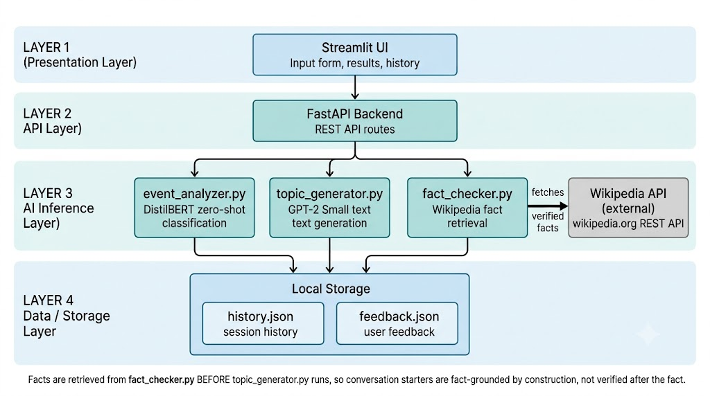

# Personalized Networking Assistant

An AI-powered web application that generates personalized, fact-grounded conversation starters for networking events. Built as a capstone project for the SmartBridge Google Cloud Generative AI internship.

## Problem

Approaching new contacts at professional or social networking events can be intimidating, often resulting in superficial small talk or missed opportunities for meaningful connection. Preparation is typically manual and last-minute.

## Solution

This assistant automates context-aware preparation: it extracts key themes from an event description, retrieves verified facts about those themes from Wikipedia, and generates tailored conversation starters — grounded in real facts, not invented ones.

## Features

- **Event theme extraction** — DistilBERT zero-shot classification identifies key themes from an event description
- **Fact-grounded generation** — Facts are retrieved from Wikipedia *before* generation, so conversation starters are fact-checked by construction, not verified after the fact
- **Conversation starter generation** — GPT-2 Small generates natural-language starters using themes, bio, interests, and verified facts as context
- **Standalone Quick Fact-Check** — Independent topic lookup, decoupled from starter generation
- **Session history** — Every generation session is logged locally
- **Feedback** — Thumbs up/down on each starter, with a feedback history view

## Tech Stack

- **Backend:** FastAPI
- **Frontend:** Streamlit
- **NLP:** Hugging Face Transformers (DistilBERT for zero-shot classification, GPT-2 Small for text generation)
- **Fact source:** Wikipedia REST API
- **Storage:** Local JSON files (`history.json`, `feedback.json`)
- **Testing:** Pytest

## Architecture



See the full documentation in Folders 1-8 of this repository for detailed requirements, design decisions, and testing.

## Setup

**Pre-requisites:** Python 3.11+ (3.13 also works), pip, Git

```bash
git clone https://github.com/Juveriyah-Rafiquee/Personalized-Networking-Assistant.git
cd Personalized-Networking-Assistant
python -m venv venv
```

Activate the virtual environment:
- Windows: `venv\Scripts\Activate.ps1`
- Mac/Linux: `source venv/bin/activate`

```bash
pip install -r requirements.txt
```

## Running the App

Two terminals are needed, both with the virtual environment active:

**Terminal 1 — backend:**
```bash
uvicorn app.main:app --reload
```

**Terminal 2 — frontend:**
```bash
streamlit run frontend/streamlit_app.py
```

- Streamlit UI: http://localhost:8501
- FastAPI interactive docs (Swagger): http://127.0.0.1:8000/docs

## Known Limitations

- GPT-2 Small (not fine-tuned) can produce short or generic conversation starters — a known limitation of the base model, not the pipeline
- `/generate-conversation` takes ~10-20 seconds due to CPU-only sequential inference of two transformer models
- Scoped for single-user local demo use, not concurrent multi-user load

## Testing

```bash
pytest tests/ -v
```
